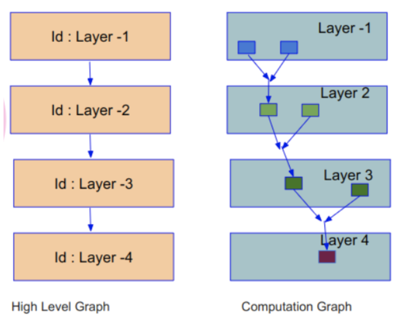
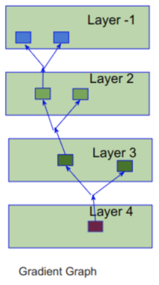
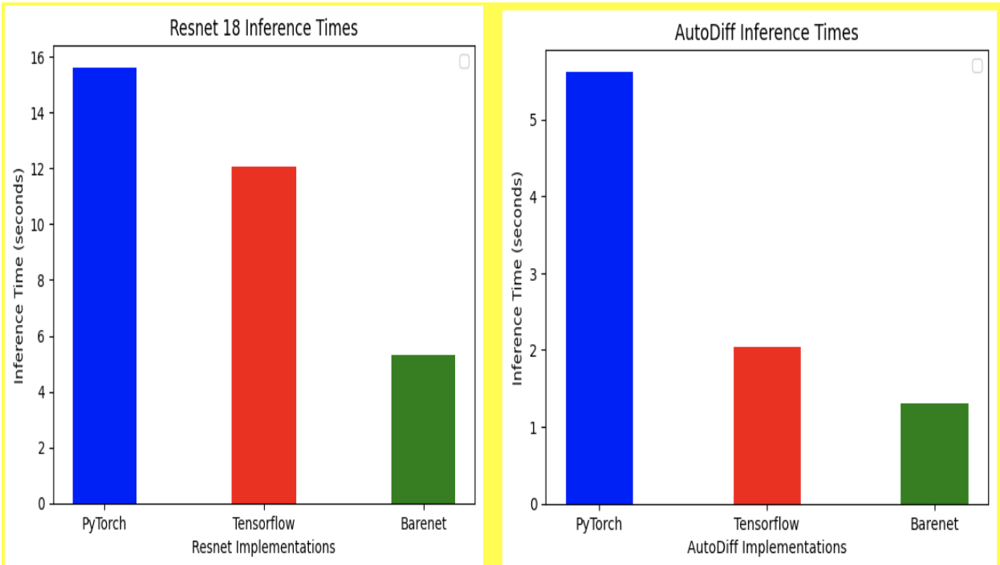

# Improvements on Barenet: Auto-differentiation and ResNet

## Authors
- Tony Kimathi
- Ayman Charafeddine
- Animesh Mishra

## Abstract
Barenet, a CUDA-based project developed within the "Big Data and Machine Learning Systems" course in Spring 2024, aimed to introduce GPU programming and illustrate tensor abstraction for facilitating tensor operations implementation. However, it faced challenges in efficiency, error-proneness, and scalability due to manual backward propagation and gradient calculation methods. This project presents efforts to enhance Barenet by introducing auto-differentiation to streamline processes and optimize performance, making it more robust and adaptable to complex modeling requirements like ResNet architectures. Our implementation of autodiff offers a 2x improvement compared to manual propagation. Our implementation of Resnet-18 is roughly on par with the implementation of Resnet18 in Pytorch and Tensorflow. We have also implemented an auto-differentiation training framework for training MultiLayered Perceptron.

## Introduction
Barenet is a barebones CUDA project developed in the course Big Data and Machine Learning Systems, CSCI-GA.3033(077), Spring 2024. The project's goal was to introduce GPU programming and demonstrate the abstraction of tensors to make it easy to implement tensor operations.

Challenges faced by Barenet:
- **Inefficient**: Manual backward propagation and gradient calculation make it inefficient and cumbersome.
- **Error-prone**: Manual methods increase the risk of errors in calculations due to human oversight or computational inaccuracies.
- **Not scalable**: Manual updates make it unsuitable for advanced modeling as models and datasets grow larger and more complex.

## Motivation
The motivation for this work is to enhance Barenet by introducing auto-differentiation to streamline and optimize these processes. Automating this process and extending Barenet to include sophisticated models like ResNet is crucial for modern machine learning applications.

## Implementation Challenges
- **Understand the Dataflow Graph**: Ensuring accurate analysis and optimization of model performance.
- **Apply Reverse-Mode Auto-Differentiation Correctly**: Implementing backpropagation accurately and efficiently.
- **Implement Layers Before Complex Models**: Updating basic layers and adding essential layers such as flatten and convolution before integrating complex models like ResNet.

## State of the Art Systems
- **Pytorch**
  - Autograd
  - torch.nn.Transformer
  - Torchvision
- **Tensorflow**
  - tf.GradientTape
  - tfm.nlp.layers.Transformer
  - tf.keras.applications.ResNet50

## Design and Implementation
### ResNet-18
The ResNet-18 model addresses the vanishing gradient problem through residual blocks. The architecture includes:
- Initial convolutional layer
- Four sets of residual blocks with increasing filter sizes: 64, 128, 256, and 512
- Each block contains two convolutional layers with a skip connection
- Flattening the output and passing through a fully connected layer
- Softmax activation for classification

### Auto-diff
A computation graph records and breaks down operations into:
- Addition (+)
- Multiplication (*)
- Subtraction (-)
- Division (/)
- Exponential (e)
- Log
- Squared (x^2)

The gradient computation rules are predefined. A gradient graph is constructed after the computation graph, using topological sort to determine the order of gradient computation. Forward and Backward methods are defined for each operation. During the training loop, forward and backward passes are conducted for each batch, and gradients are propagated through the computational graph.

The parameter update step uses a direct gradient descent approach. The `detach()` function is used to sever a tensor's connection to the computational graph, allowing weight updates without altering the graph structure.

## Evaluation
Our implementation was tested against Tensorflow and PyTorch implementations on an HPC using a single RTX8000 GPU. The results show that our implementation outperforms the corresponding implementations of PyTorch and Tensorflow for ResNet-18.

## Individual Contributions
- **Tony Kimathi**: Pooling layer, Problem Definition & Motivation, State of the Art Systems, Technical Challenges, Related Work, Slides
- **Ayman Charafeddine**: Flatten layer, Design of Solution, Future Work, Slides
- **Animesh Mishra**: Conv layer, Our Solution (Implementation), Evaluation, Slides

Collaboratively worked on tensor3D, auto diff, resnet, op_gemm.cuh, and op_conv.cuh using Zoom calls and physical meetings to pair-program.

## References
1. O’Shea, K., & Nash, R. (2015, November 26). An Introduction to Convolutional Neural Networks. arXiv.org. [Link](https://arxiv.org/abs/1511.08458)
2. Gholamalinezhad, H., & Khosravi, H. (2020, September 16). Pooling methods in deep neural networks, a review. arXiv.org. [Link](https://arxiv.org/abs/2009.07485)
3. He, K., Zhang, X., Ren, S., & Sun, J. (2015, December 10). Deep residual learning for image recognition. arXiv.org. [Link](https://arxiv.org/abs/1512.03385)
4. Paszke, A., et al. (2019, December 3). PyTorch: An Imperative Style, High-Performance Deep Learning Library. arXiv.org. [Link](https://arxiv.org/abs/1912.01703)
5. Abadi, M., et al. (2016, May 27). TensorFlow: A system for large-scale machine learning. arXiv.org. [Link](https://arxiv.org/abs/1605.08695)
6. A Gentle Introduction to torch.autograd — PyTorch Tutorials 2.3.0+cu121 documentation. [Link](https://pytorch.org/tutorials/beginner/blitz/autograd_tutorial.html)
7. Transformer — PyTorch 2.3 documentation. [Link](https://pytorch.org/docs/stable/generated/torch.nn.Transformer.html)
8. torchvision — Torchvision 0.17 documentation. [Link](https://pytorch.org/vision/0.17/_modules/torchvision.html)
9. Introduction to gradients and automatic differentiation. TensorFlow. [Link](https://www.tensorflow.org/guide/autodiff)
10. TFM.NLP.Layers.Transformer | TensorFlow v2.16.1. TensorFlow. [Link](https://www.tensorflow.org/api_docs/python/tfm/nlp/layers/Transformer)
11. ResNet50 | TensorFlow. [Link](https://www.tensorflow.org/api_docs/python/tf/keras/applications/ResNet50)
